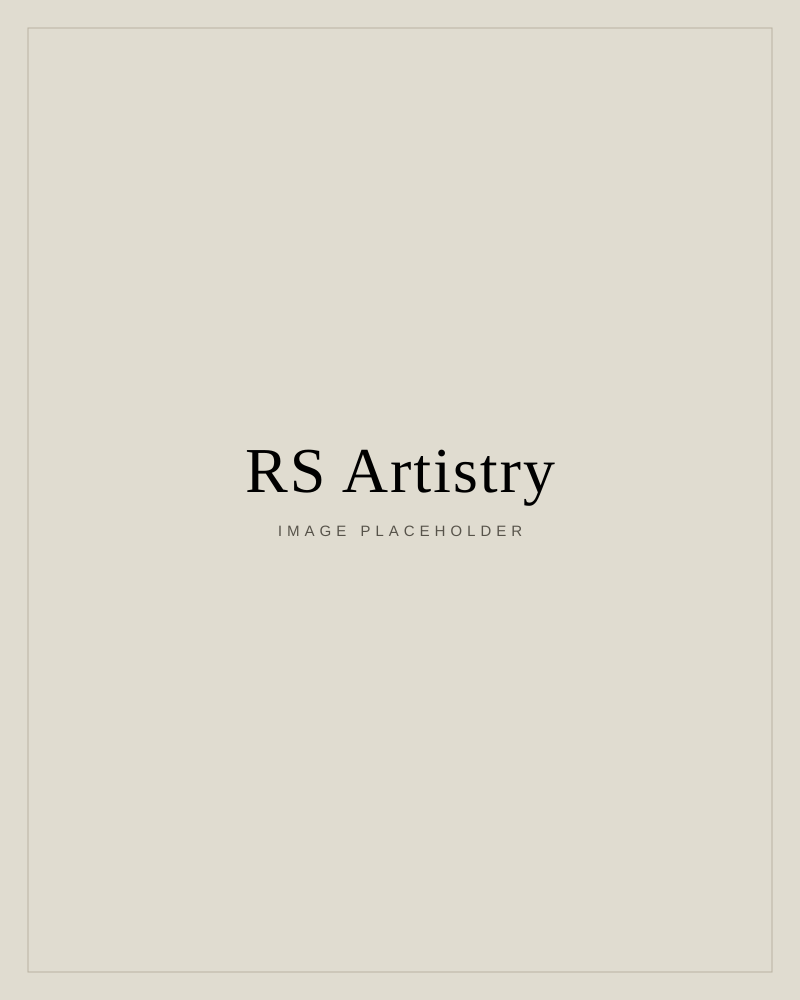

# RS Artistry

A static, production-ready website for **RS Artistry**, a Sydney makeup artistry
studio run by Rae and Silvia. Built from the Stitch "Editorial Warmth" design as
a clean, responsive, multi-page site with hand-authored HTML, CSS and a little
vanilla JavaScript. No build step and no dependencies, so it hosts on any
standard web host.

## Pages

| File | Page |
| --- | --- |
| `index.html` | Home |
| `about.html` | About (the founders, philosophy) |
| `services.html` | Services (bridal, events, editorial) |
| `gallery.html` | Gallery (masonry, filters, lightbox) |
| `lashes.html` | Lashes (Shopify-ready product shop) |
| `contact.html` | Contact (enquiry form, location, hours) |
| `book.html` | Book (Acuity scheduler placeholder) |

## File structure

```
rsartistry/
├── index.html, about.html, services.html, gallery.html,
│   lashes.html, contact.html, book.html
├── css/
│   └── styles.css          # single consolidated stylesheet
├── js/
│   └── main.js             # nav, scroll reveal, gallery filter, lightbox
├── images/
│   ├── placeholder-*.svg   # named placeholder slots (swap with real photos)
│   ├── gallery/            # drop real gallery photos here
│   ├── products/           # drop real lash product photos here
│   └── team/               # drop real founder/studio photos here
├── favicon.svg
├── README.md
└── _stitch_export/         # original Stitch design reference (not deployed)
```

The `_stitch_export/` folder is kept for reference only. It is not linked from
the site and does not need to be uploaded when you deploy.

## Brand

Strictly greige and black. All colour comes from the photography. Tokens live at
the top of `css/styles.css` under `:root`.

- Background greige `#DFDBCF`
- Ink / logo / key lines true black `#000000`
- Body text softened to `#1A1A18`
- Lighter paper `#F2EFE6`, deeper sand `#D3CDBD` (alternating sections)
- Soft taupe hairlines `#B9B2A1`
- Headings: Cormorant Garamond (light). Body and UI: Jost.

## Swapping in real photos

Every image currently points at a named SVG placeholder and carries a `data-img`
attribute that suggests the final filename, for example:

```html

```

To use a real photo:

1. Add your image to the matching folder, e.g. `images/team/rae.jpg`.
2. Change `src` to that path (and remove the `data-img` hint if you like).
3. Keep the alt text accurate for accessibility and SEO.

Suggested aspect ratios (match the placeholder you are replacing):
portrait `4:5` and `3:4`, landscape `3:2`, square `1:1`, hero/CTA `3:2` wide,
map `21:9`, lash products `1:1`. All images are lazy loaded already.

## Booking (Acuity)

Open `book.html` and find the `#acuity-embed` container. Paste your Acuity inline
embed snippet inside it, then delete the `.booking-embed__placeholder` block. The
container is intentionally unstyled on the inside, so the scheduler iframe drops
in flush with no restyling.

## Lashes (Shopify)

`lashes.html` is built as a real shop. Each product is an `<article class="product-card">`
with a `data-product-handle`, a `data-price` value and a `data-buy-button`. The
buy buttons are intentionally inactive with a "Shop launching soon" state.

To go live, wire each card to Shopify (Buy Button JS or the Storefront API):
replace the `data-buy-button` element with your Shopify Buy Button for the
matching `data-product-handle`. The markup and layout do not need to change.

## Gallery

- Masonry/mosaic layout mixing portrait and landscape crops.
- Filter chips: All, Bridal, Events, Soft Glam, Editorial (each item has a
  `data-category`).
- Click, tap or press Enter on any image to open the full-screen lightbox.
  Navigate with the on-screen arrows, the left/right arrow keys, or a swipe on
  touch devices. Close with the X, a click on the backdrop, or Escape.

## Deploying

Upload the folder contents to any static host (Netlify, Vercel, Cloudflare Pages,
GitHub Pages, or classic shared hosting via FTP). There is no build step.
You can exclude `_stitch_export/` and `README.md` from the upload.

## Accessibility and performance

- Semantic landmarks, `alt` text on every image, visible focus states,
  keyboard-operable gallery and menu.
- `prefers-reduced-motion` disables the hero zoom, marquee and scroll reveals.
- Native lazy loading and async decoding on all non-hero images.
- Copy is kept free of em dashes throughout.
